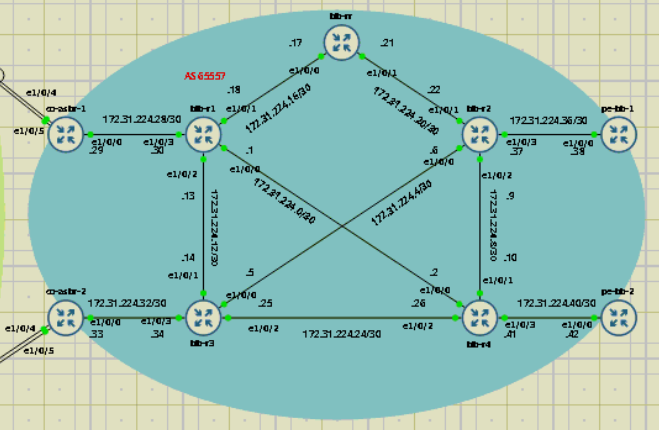
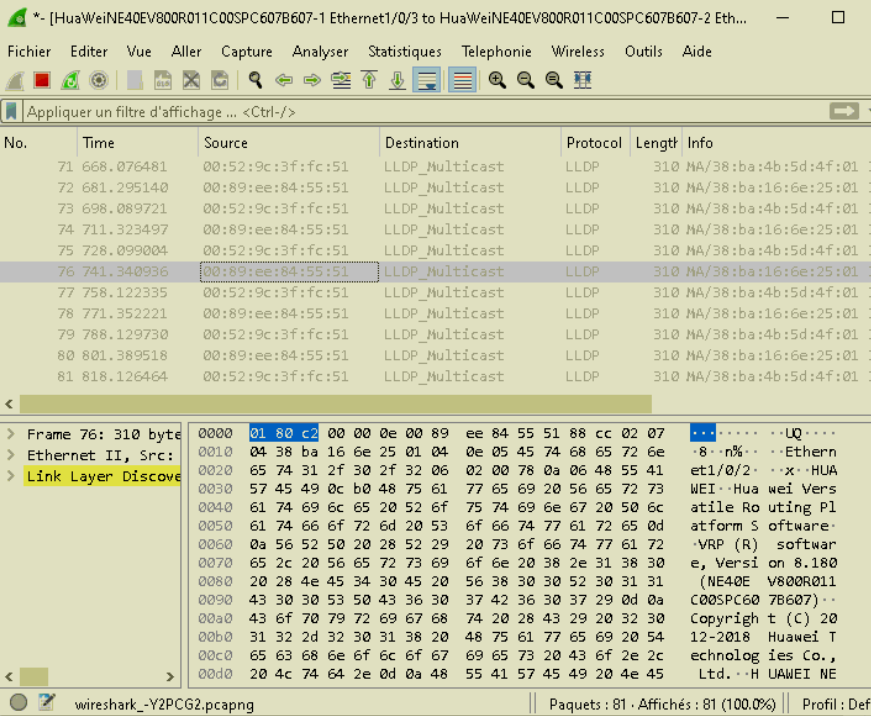
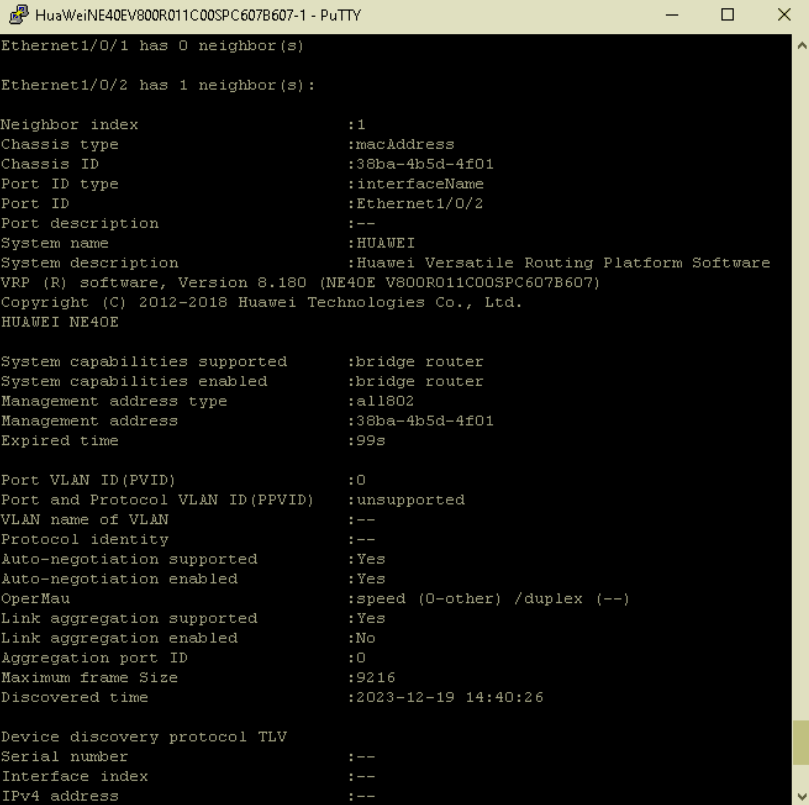

Here, we delve into the story of misnumbered interfaces on a GNS3 template, or how LLDP saved my ass.

===

# In the beginning

For reasons™, I had to set up a lab comprising of virtual Huawei routers. I had no particular restrictions as for which model exactly, from the moment it ran a fairly recent version of VRP software (Huawei's Versatile Router Platform).

Since Huawei's eNSP simulation platform [is now discontinued](https://web.archive.org/web/20220414075127/https://forum.huawei.com/enterprise/en/ensp/thread/622830-100289), the next best choice was to use GNS3.

Browsing the [GNS3 appliances repository](https://gns3.com/marketplace/appliances) revealed that indeed, there was an existing template for a virtual Huawei NE40E.

After a little bit of digging, the correct image for the template was found [on the vendor forum](https://web.archive.org/web/20220413025714/https://forum.huawei.com/enterprise/en/ne40e-image-for-the-eve-ng/thread/756237-861).

## Lab structure

As for the lab, the goal was to reproduce a typical ISP backbone with MPLS transport and BGP-free core configuration. So we have the following structure:


## Where things go wrong

Once the lab was set up as above, I started configuring the IGP protocol on the first two leftmost routers at the top.
However, they weren't able to ping each other:

```sh
<HUAWEI>ping 172.31.223.30
  PING 172.31.223.30: 56  data bytes, press CTRL_C to break
    Request time out
	Request time out
	Request time out
	Request time out
	Request time out

  --- 172.31.223.30 ping statistics ---
    5 packet(s) transmitted
	0 packet(s) received
	100.0% packet loss
```

From there I was a bit puzzled. Did I made a mistake in my configuration ? After triple checking, apparently, no. So the problem was somewhere else...


# The culprit

First, after looking at the corresponding NE40E template for EVE-NG, I suspected some driver issues, since this one uses ```vmxnet3``` NICs instead of ```e1000```. So, I tinkered with the official GNS3 template to move all VM NICs to ```vmxnet3```. But no luck, same problem !

After some more tests, I found that only ```eth0``` interfaces (```GigabitEthernet 0/0/0``` on the NE40E) were working, when put face-to-face (ie both routers linked through this interface). Since the rest of the interfaces were named ```Ethernet```, I thought it may be some "classical" full-duplex / half-duplex configuration issue. However, the collision/error counters weren't matching this hypothesis. If it was the case, I should have *some* packet loss, not packet loss *all the goddamn time*.

## LLDP to the rescue

It was time to resort to Wireshark (to be honest, I should have done this earlier). The packet capture showed no ARP queries or answer from any of the routers, as if the packets were never sent on the link.



 However, and as you can see, there was plenty of LLDP advertisements. This gave me the idea to try and see what LLDP had to say about all this. And oh boy, it did answer my questions.



Maybe it isn't very clear because of the lack of context, but at that moment, the other router was linked through ```Ethernet 1/0/3```, *not* ```Ethernet 1/0/2```. From there, it became obvious that the [current template](https://github.com/GNS3/gns3-registry/blob/579ff539991090c38b92a967ac8fa2b9e87e5f87/appliances/huawei-ne40e.gns3a) had off-by-one interface numbering issues.

Hurra ! Problem found :) Now, onto the fixing part !

## Submitting fixes, and a small irc discussion

Because GNS3 doesn't allow to "skip" interfaces in the template definition (as EVE-NG does), I had no clue as to how I should proceed for redefining the template. So I asked on #gns3 at libera. Luckily, someone encountered the exact same problem as me and managed to find their way in the GUI. But only by modifying interface naming *after* template import. Since they shared their screenshots with me, I was able to redo the exact same thing on my side. From there, I only had to copy the ```custom_adapters``` parts of the local device definition into my template modification.

So, the new template reads something like this:
```json
{
    "appliance_id": "03aa586b-5666-49e9-a70c-e5935fdbc23d",
    "name": "HuaWei NE40E",
    "category": "router",
	...
    "qemu": {
        "adapter_type": "e1000",
        "adapters": 12,
        "custom_adapters": [
                {
                    "adapter_number": 0,
                    "port_name": "Gi0/0/0"
                },
                {
                    "adapter_number": 1,
                    "port_name": "Mgmt0/0"
                },
                {
                    "adapter_number": 2,
                    "port_name": "Ethernet1/0/0"
                },
				...
				{
                     "adapter_number": 11,
                    "port_name": "Ethernet1/0/9"
                }
        ],
	}
}
```

Soon after I opened [a pull request in GNS3 registry](https://github.com/GNS3/gns3-registry/pull/840) for the fix, it was merged. Thank you Jeremy ;)

Sometimes problems aren't as obvious as they look. I'm glad I was able to find the source of the issue and contribute with my fix upstream. Also, this was my first PR on a big project like GNS3. I'm very happy to have given back to the community.
