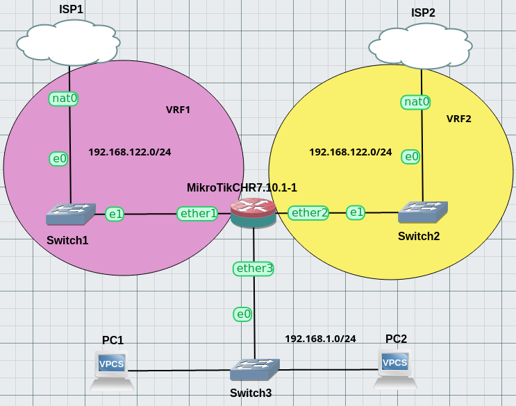
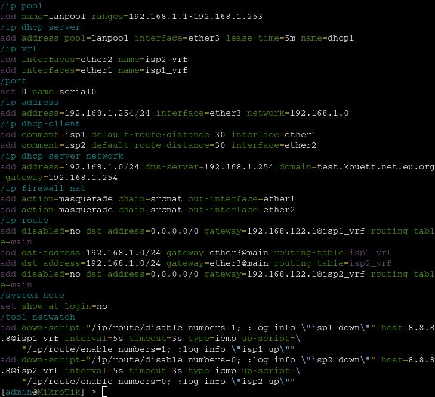
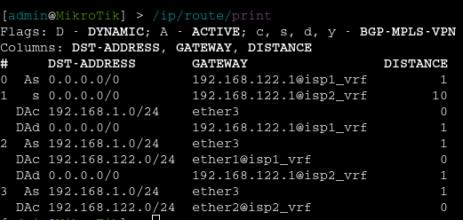
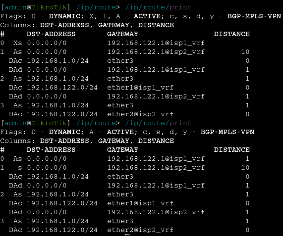

In this post, I'll explain how I made an alternative configuration for Dual-ISP HA Failover with a Mikrotik router. It's fairly different from [the official one](https://help.mikrotik.com/docs/pages/viewpage.action?pageId=26476608).

===

# The Lab
Here is the GNS3 lab I used to proof this configuration:

There are 3 networks to which the router is attached, 1st one being the lan with 2 pcs, 2nd one being isp1 box lan (in vrf1 from the router's pov) and 3rd one being isp2 box lan network (ibid).



! This setup has only been tested in simulation, it _should_ work irl but I cannot vouch for it.

! As for now, there's no support for IPv6 with this config.


## Goal
The general idea is that we have two different ISPs providing Internet access. There's one "main" ISP and one "backup" ISP that we want to use whenever the first one fails.

This second ISP can be another landline or a radio data link.

However I _do not_ want to use the route-tagging and route-scope features of RouterOS since they have been subject to breaking changes in the past (and make the config way less understandable in my imo).

Because of this we're going to use [VRF lite](https://en.wikipedia.org/wiki/Virtual_routing_and_forwarding) and route leaking instead.

## Addressing
We have the following subnets in use:
- ```192.168.122.0/24``` private subnet used by both ISP1 and ISP2 (_this is also linked to a limitation of GNS3 regarding NAT_).
- ```192.168.1.0/24``` as the LAN network.

!!! Regarding any address overlaps, there should be no need to renumber stuff - all the networks are in separate VRFs, including ```main```. NAT should do the rest. However I haven't tested this particular case, so take my advice with a pinch of salt.

# Implementation
In this section, we'll explain in a step-by-step manner how to implement this config on the Mikrotik Cloud Hosted Router.

First off, here's the full config (for reference):



## network config
As a first step, we'll start by adding our VRFs:
```sh
[admin@MikroTik]> /ip/vrf/add interfaces=ether1 name=isp1_vrf
[admin@MikroTik]> /ip/vrf/add interfaces=ether2 name=isp2_vrf
```

we can now setup our dhcp client and check that connectivity to isp1 and isp2 works okay:

```sh
[admin@MikroTik]> /ip/dhcp-client/add comment=isp1 add-default-route=yes interface=ether1
[admin@MikroTik]> /ip/dhcp-client/add comment=isp2 add-default-route=yes interface=ether2
```
```sh
[admin@MikroTik]> /tool/ping count=3 vrf=isp1_vrf 8.8.8.8
[admin@MikroTik]> /tool/ping count=3 vrf=isp2_vrf 8.8.8.8
```

we can also setup the lan part:
```sh
[admin@MikroTik]> /ip/address/add address=192.168.1.254/24 interface=ether3 network=192.168.1.0
[admin@MikroTik]> /ip/pool/add name=lanpool ranges=192.168.1.1-192.168.1.253
[admin@MikroTik]> /ip/dhcp-server/network/add address=192.168.1.0/24 dns-server=192.168.1.254 domain=yourdomainhere gateway=192.168.1.254
[admin@MikroTik]> /ip/dhcp-server/add address-pool=lanpool interface=ether3 lease-time=1h name=dhcp1
```

## routing and nat
### first part
We now have to add the default routes in the ```main``` vrf and route-leak ```main``` into ```isp1_vrf``` and ```isp2_vrf```. I'm using static routes here since there's only a handful of them.

!!! The LAN address of the ISP's gateway should be available through DHCP - replace ```192.168.122.1``` with it.

Let's begin with the first default route:
```sh
[admin@MikroTik]> /ip/route/add dst-address=0.0.0.0/0 gateway=192.168.122.1@isp1_vrf routing-table=main
```

Then, add NAT and do a little ping test from main:
```sh
[admin@MikroTik]> /ip/firewall/nat/add action=masquerade chain=srcnat out-interface=ether1
```
```sh
[admin@MikroTik]> /tool/ping 8.8.8.8
```

But ! We still don't have access to the Internet from the LAN PCs. So we'll also need to leak our local LAN route into ```isp1_vrf```:
```sh
[admin@MikroTik]> /ip/route/add dst-address=192.168.1.0/24 gateway=ether3@main routing-table=isp1_vrf
```
!!! There's no interconnection interfaces between our VRFs, so the leaks are done without intermediate hops.

We should now have IPv4 connectivity from the LAN PCs:
```sh
PC1> ip dhcp
DORA IP 192.168.1.253/24 GW 192.168.1.254

PC1> ping 8.8.8.8
```
### second part
Connectivity through ISP1 is now up and running. We have to do the same again for ISP2:

```sh
[admin@MikroTik]> /ip/route/add dst-address=0.0.0.0/0 gateway=192.168.122.1@isp2_vrf routing-table=main distance=10
[admin@MikroTik]> /ip/firewall/nat/add action=masquerade chain=srcnat out-interface=ether2
[admin@MikroTik]> /ip/route/add dst-address=192.168.1.0/24 gateway=ether3@main routing-table=isp2_vrf
```
!! Don't forget to add the administrative ```distance``` bit for active/backup config ! otherwise you can also add none if you dont care which access is used, you'll be doing [ecmp](https://en.wikipedia.org/wiki/Equal-cost_multi-path_routing) aka _load balancing_ in this case

Your routing table should look like this:


## monitoring and disabling routes
There's just _one piece_ missing to our setup, which is the monitoring of the Internet connectivity of each VRF. For this, we'll use the [netwatch tool](https://help.mikrotik.com/docs/display/ROS/Netwatch) for a little bit of scripting.

We're going to add two ping probes (one for each ISP) with the following script and values:

```sh
[admin@MikroTik]> /tool/netwatch/add down-script={/ip/route/disable numbers=0} host=8.8.8.8@isp1_vrf interval=5s timeout=3s type=icmp up-script={/ip/route/enable numbers=0}
[admin@MikroTik]> /tool/netwatch/add down-script={/ip/route/disable numbers=2} host=8.8.8.8@isp2_vrf interval=5s timeout=3s type=icmp up-script={/ip/route/enable numbers=2}
```

Routes should now be disabled in the event of a connectivity loss, and automatically re-enabled when connectivity comes back:


