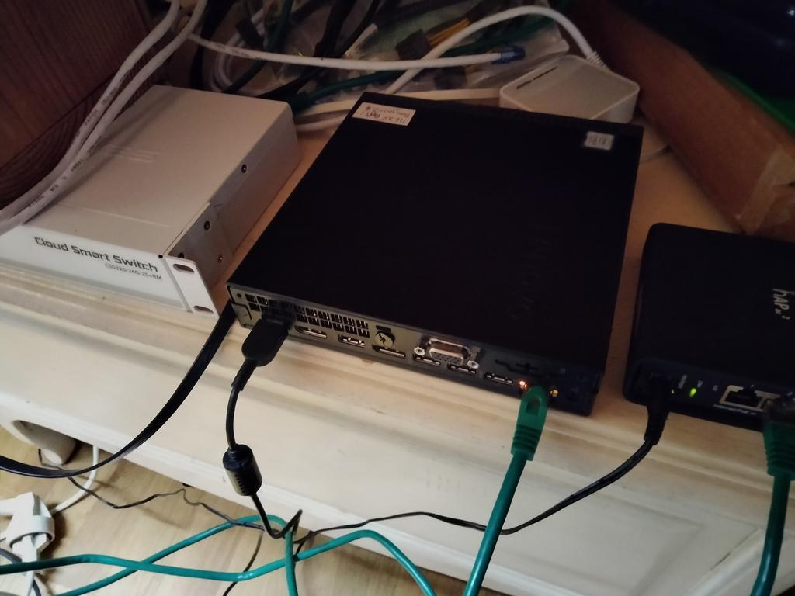
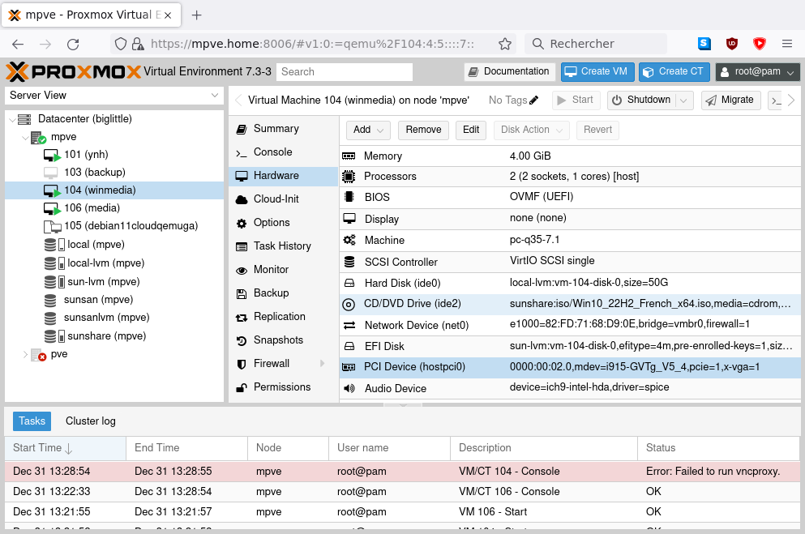
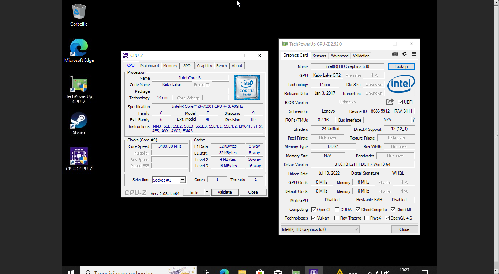
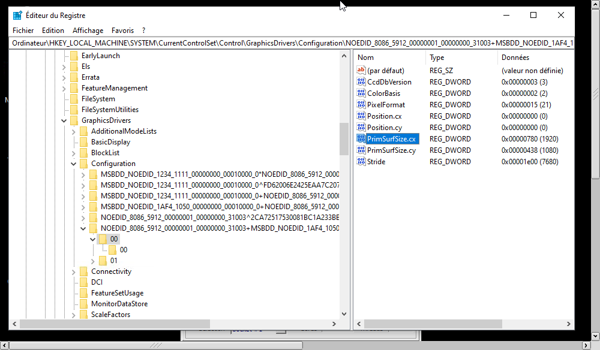
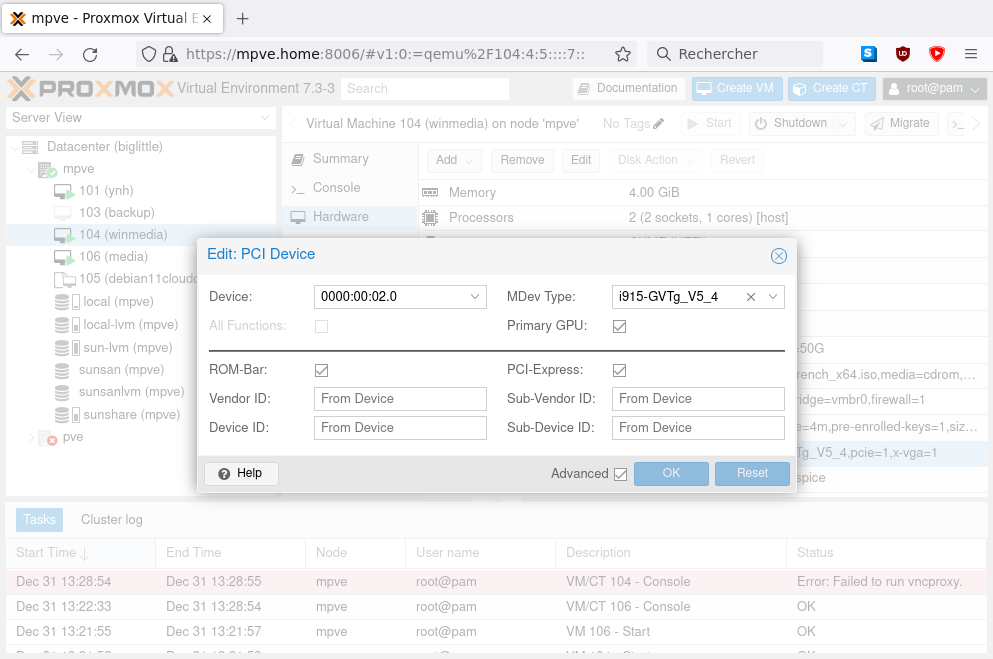
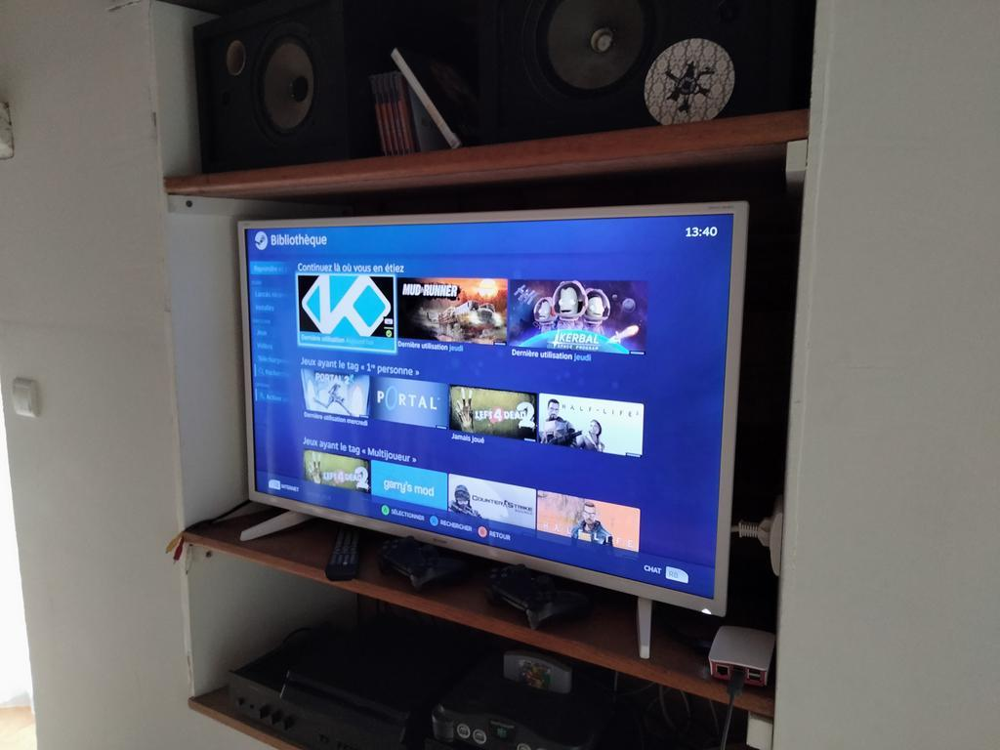

This blog post aims to give more explanations and an in-depth process as for how the fuck I managed to make [a raspberrypi 3b+ kodi media center capable of smoothly decoding _any_ video codec](https://soc.kouett.net.eu.org/notice/ARAOER7r0X2IKND3KK).

===

# things you'll need
For this, we used the following stack of things:

## thinking sand,  pieces and cables to get
First of all, as you may have guessed given the very reduced hardware decoding capabilities of any of the rasbperry pi models, we're not going to use it _on its own_.

Here's the catch: all of the decoding happens in a virtual machine. The rpi is merely a remote display client. As for the VM part, no need for a beefy machine.

I've picked a ThinkCentre mini m710q for the [codecs supported by its integrated GPU (the HD 630 packaged with the i3-7100T)](https://www.intel.com/content/www/us/en/developer/articles/technical/encode-and-decode-capabilities-for-7th-generation-intel-core-processors-and-newer.html). Here it is in all its glory:



The raspberrypi I used is the well-known RPI3B+ model, as seen in the intro of this post.

In short, you'll need the following bits for the setup to work correctly:
- a x86 machine supporting virtualization and GVT-g with hardware video decode (for the hypervisor).
- a raspberry pi 3B or B+ ([models supported by steamlink](https://help.steampowered.com/en/faqs/view/6424-467A-31D9-C6CB))
- a gigabit wired network between the two. it's important the two machines are on the same L2 segment.
- your usual tv set with an hdmi input.
- other bits and bobs: an hdmi cable, a microSD card, a usb key and a linux computer.

! A wired network is a must-have, wifi performance often being not enough for this setup. ymmv.

## cursed code to download
As for the software stack, we're going to use:
- latest [Proxmox VE](https://pve.proxmox.com/wiki/Main_Page) hypervisor on the thinkcentre.
- [Raspberry Pi OS](https://www.raspberrypi.com/software/operating-systems/) ®, The Official Raspberry Foundation™ System (```buster armhf``` version).
- [Windows 10 ISO installer](https://www.microsoft.com/en-us/software-download/windows10ISO) for the VM.
- the [PC Steam Client](https://store.steampowered.com/about/).
- [Kodi Matrix 19.5](https://mirrors.kodi.tv/releases/windows/win64/kodi-19.5-Matrix-x64.exe) release.
- ```steamlink``` software package for the Raspberry Pi OS ®.

# the install process
## on the hypervisor
First of all, we need to prepare some things on the hypervisor before actually beginning with the install of the VM. Thanks to [this great thread on the Proxmox Forum](https://forum.proxmox.com/threads/intel-gvt-g-questions.82165/), we've got all the options we need to set in order to enable GVT-g support on the hypervisor !

1. Modify kernel command line, edit ```GRUB_CMDLINE_DEFAULT``` in ```/etc/default/grub``` so that it reads:
   ```sh
   GRUB_CMDLINE_LINUX_DEFAULT="quiet intel_iommu=on video=vesafb:off video=efifb:off video=simplefb:off modules_load=kvmgt"
   ```
2. Modify ```/etc/modules``` to load the following kernel modules:
    ```sh
    vfio
    vfio_iommu_type1
    vfio_pci
    vfio_virqfd
    kvmgt
    ```
3. edit ```/etc/modprobe.d/gvtg.conf``` to ask the ```i915``` kernel module to enable gvt-g:
    ```sh
    options i915 enable_gvt=1
    ```
4. run ```update-grub``` and ```update-initramfs -u -k all```. Then reboot the hypervisor.

!!! You should now have the files ```i915-GVTg_V5_4``` and ```i915-GVTg_V5_8``` in ```/sys/bus/pci/devices/0000\:00\:02.0/mdev_supported_types/``` (or elsewhere, depending on the pci address of the igpu).

### vm install
Now onto the tricky part ! First of all, we start by defining our new VM in Proxmox VE. You should have roughly the same configuration as this one to begin with (the main gotchas are the uefi boot mode, the ```pc-q35-7.1``` machine model and the gvt-g gpu):




!! Attention: we can't boot headless for the initial windows setup. you'll need to add the default proxmox screen device and uncheck the "make this the main gpu" box.

By doing this, you should now have access to VM controls with the native noVNC console on the hypervisor. Go on with the windows install, make sure all the video drivers install correctly. CPU-z and GPU-z should show you native cpu and gpu detected:



Then, follow [this guide](https://www.tightvnc.com/doc/win/TightVNC_for_Windows-Installation_and_Getting_Started.pdf) to install TightVNC as a system service on the windows vm. You can now connect directly to the vm with the vnc client of your choice.

! Attention: Make sure the vnc part works ! That'll be your only access to the vm console afterwards.

Since we have no possibility of using a dummy plug dongle for edid simulation, we have to force the resolution through some good old ```regedit``` (see [this superuser question](https://superuser.com/questions/990398/setting-display-resolution-beyond-1024x768-with-headless-windows-10)):



!!! you can now stop the vm and remove the default screen device. check back the "make this the main gpu" box:



!!! Don't forget to install the [Steam Client](https://store.steampowered.com/about/) on the VM.

### kodi install
There's not much to say about the Kodi install, we're using the standard x64 installer from the "Matrix" release. I'm not using Nexus (yet!) since I've had some issues regarding smb shares with it.

! If you ever get a DirectX error when launching Kodi, verify the "main gpu" box is ticked in proxmox and no screen is attached to the VM.

## on the raspberrypi
Good news ! We're now done with the server side of things. Let's get to the "client" now...

### system install
Unpack the ```.img.xz``` file you previously got and ```dd``` it to the microSD card of the raspberry pi. By default, latest OS images come with ssh _disabled_. In order to be able to connect on first boot, you'll need to create the ```ssh``` and the ```userconf.txt``` files in the fat32 ```/boot``` partition of the system, as explained [here](https://www.raspberrypi.com/documentation/computers/remote-access.html#enabling-the-server) and [here](https://www.raspberrypi.com/documentation/computers/configuration.html#configuring-a-user).

! Use ```echo -n YourPassword | openssl passwd -6 -stdin``` to generate the hash. Official doc contains errors.

### steamlink install
Installing steamlink is as straightforward as [what's explained in valve's forum](https://steamcommunity.com/app/353380/discussions/6/2806204039992195182/?snr=1_14_1581__1580)

Just enter
```sh
sudo apt update
sudo apt install steamlink
steamlink
```
and voilà ! the first time is a bit slower since the wrapper will download the latest version of the client first.

!!! You can now use the user session LXDE autostart feature [as documented in the raspberrypi forum](https://forums.raspberrypi.com/viewtopic.php?t=294014) to launch steamlink on boot.

! If you encounter auto-update errors upon steamlink automatic launch but not on manual launch, there's an "offline" flag in the commandline options - that's what I used to solve this issue.

You should now be able to connect to the virtual machine we set up earlier (given steam client is up and running). You can now add a shortcut to Kodi in order to have it in the launch menu when connecting:



!!! I recommend using Steam's old big picture mode, since the newer version still has some... quality problems (including often not giving focus to the launched application !). Please follow [this guide](https://www.reddit.com/r/SteamController/comments/1254d4i/how_to_get_into_the_old_big_picture_mode_without/) for forcing big picture mode.

You're now done ! Grab that popcorn and enjoy the well-deserved movies :)
