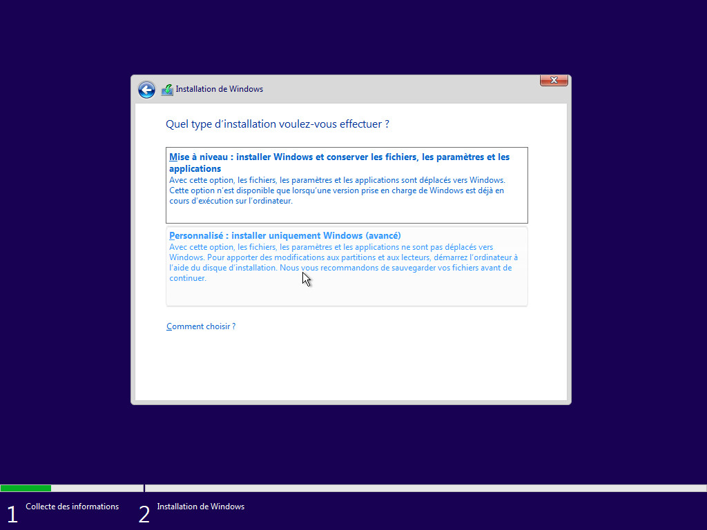
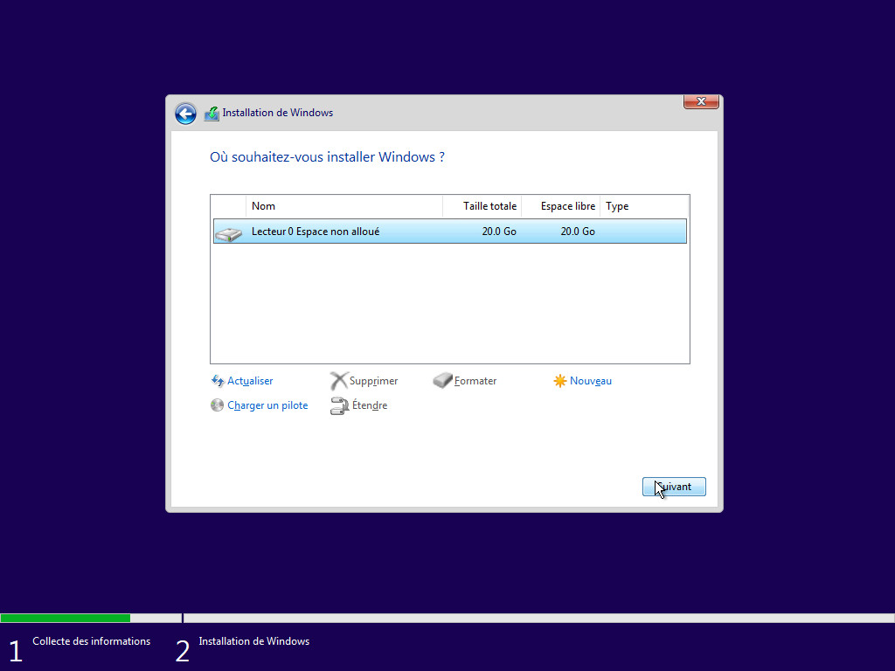
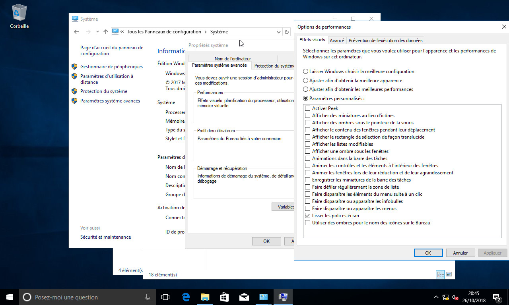
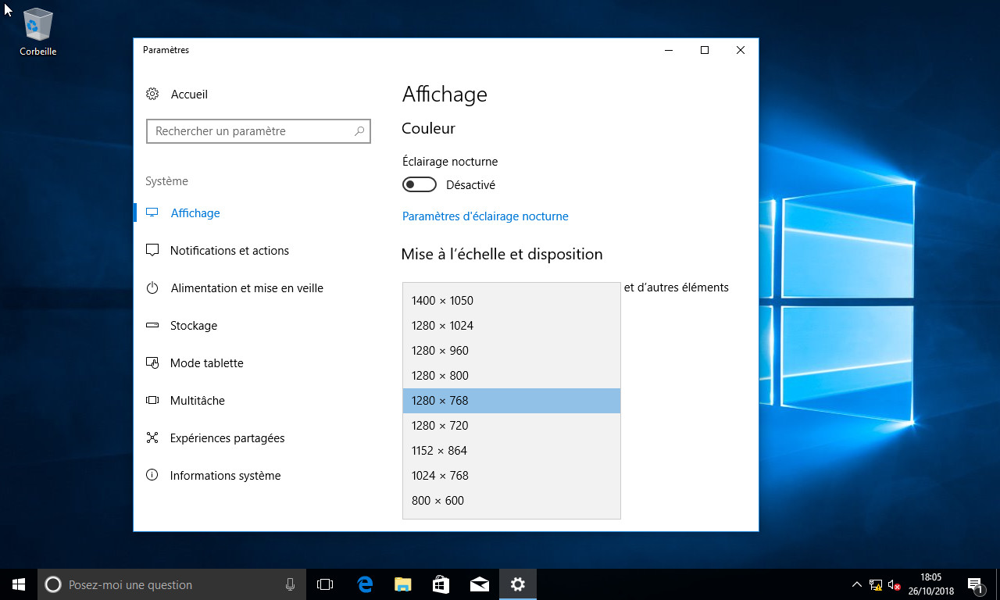
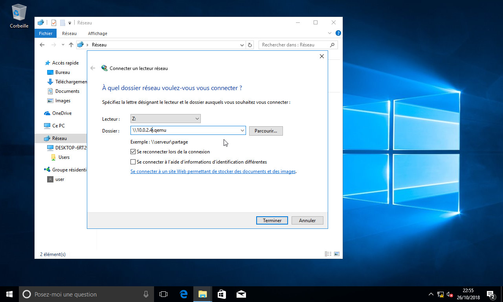

Guide pas-à-pas pour la création d'une machine virtuelle Windows 10 avec Qemu. Cet article est reposté à partir d'un ancien blog, les captures datent donc un peu (Windows 1703 était la dernière version au moment de la rédaction).

===

# Intro
Lorsque l'on utilise un système autre que Windows, il arrive fatalement un moment où on devra utiliser un programme qui ne tourne _que sur ce système_ (ou alors, dont le port pour le système que vous utilisez est _très très nul_). Ça arrive, et beaucoup de programmes n'ont pas été portés sur tous les OS, ça n'est pas spécifique aux environnements Windows. Plusieurs solutions s'offrent à vous:
 - utiliser Wine et croiser les doigts pour que ça fonctionne
 - acheter un ordinateur sous Windows
 - faire un dual-boot
 - tout écraser et installer Windows à la place !

Mais il est possible qu'aucune de celles-ci ne soient applicables. C'est pourquoi je vais ici décrire comment installer Windows 10 sous la forme d'une machine virtuelle QEMU. Soyez toutefois au courant que cela présente des restrictions parraport à une installation "native":
 - moins de performances processeur, car le CPU est partagé (```kvm```) ou émulé (```tcg```).
 - les entrées/sorties sont plus lentes
 - la carte graphique est émulée
L'avantage principal de la virtualisation est que l'on a pas à changer de machine ou à redémarrer. De plus, QEMU peut d'émuler un partage réseau Windows, ce qui permet d'échanger des fichiers avec la VM.

Le système hôte (celui qui fait tourner QEMU) est une Debian Stretch sur un PC amd64. Je n'ai pas testé cela sur *BSD. Sur Mac OS X, il y a de fortes restrictions concernant l'utilisation de [l'accélération matérielle avec qemu](https://wiki.qemu.org/Hosts/Mac).

# Préparation
Il vous faudra bien sûr une image au format iso du disque d'installation de Windows, ainsi qu'une clé de license valide. Vous devez aussi avoir installé qemu et samba (si vous prévoyez d'utiliser la fonctionnalité d'émulation des lecteurs réseau). Les noms des paquets à installer sous Debian sont =qemu-kvm=, =qemu-system-common=, =qemu-system-x86=, =qemu-utils= et =samba= (ainsi que ses dépendances). Désactivez le lancement automatique de samba après son installation si vous ne souhaitez pas l'utiliser autrement que pour qemu (services nmbd et smbd).
## CD de drivers (*facultatif*)
Par défaut, Windows n'est pas capable d'utiliser certains lecteurs virtuels fournis par QEMU. Utiliser des disques non-IDE requiert donc un CD de drivers qui permettront l'utilisation du disque dur virtuel durant l'installation et pendant le fonctionnement normal du système hôte. Vous pouvez le télécharger sur [la page "Creating Windows virtual machines using virtIO drivers" du projet Fedora]([https://docs.fedoraproject.org/en-US/quick-docs/creating-windows-virtual-machines-using-virtio-drivers/index.html]). Je vous conseille d'utiliser la [version stable au format iso](https://fedorapeople.org/groups/virt/virtio-win/direct-downloads/stable-virtio/virtio-win.iso) du CD de drivers.

## Création de l'image raw
On crée une image disque au format ```raw```. Pourquoi raw ? Eh bien, les autres formats sont beaucoup moins performants, et comme Windows effectue beaucoup de lectures/écritures, ça devient vite inutilisable. Cette image disque va être utilisée pour le disque ```C:``` de Windows. Donc comptez au moins 20Go minimum pour pouvoir installer le système et quelques petits programmes, plus si vous comptez installer un gros logiciel. N'hésitez pas à prévoir large si besoin, ça évite de se retrouver coincé avec un disque plein, et de devoir bidouiller dans le gestionnaire de disques de Windows par la suite ;).
```sh
$ qemu-img create -f raw win.raw 20G
```
 Note: vous pouvez aussi utiliser une partition physique dédiée pour avoir encore plus de performances disque (non détaillé ici). La section ["using host drives"](https://qemu.weilnetz.de/doc/qemu-doc.html#host_005fdrives) de la documentation de QEMU explique cela.

## Script de lancement
Ce script sert à la fois lors de l'installation et de l'utilisation normale de la VM. Vous pouvez le copier-coller dans un fichier ```win.sh``` et le rendre exécutable (```chmod u+x win.sh```).

Dans mon cas, je désactive la connectivité à autre chose qu'au réseau local simulé et donc les mises à jour car je travaille hors-ligne 100% du temps avec cette VM. Vous pouvez réactiver la connectivité en passant ```restrict``` à ```off```.
   
   
J'ai aussi passé le type d'interface disque en IDE (compatible directement avec Windows, sans pilotes spécifiques à installer).

```sh
#!/bin/sh
# Script de lancement de la VM

OPTS=""
# options CPU, à adapter selon l'hôte et les perfs désirées
# 2.0G de mémoire, 3 cœurs.
OPTS="$OPTS -machine accel=kvm -smp cores=3 -m 2.0G"
# réseau (slirp) + smbshare. restrict=off pour avoir une connectivité Internet
# CHEMIN PARTAGE À CHANGER
OPTS="$OPTS -device e1000,netdev=net0 -netdev user,restrict=on,id=net0,smb=/home/user/tmp/virt/win10/share"
# stockage
# dvd1, (install de windows10) ide bus 2 device 2. CHEMIN ISO À CHANGER.
OPTS="$OPTS -drive file=/home/user/dw/iso/windows/fr_windows_10_education_version_1703_updated_march_2017_x64_dvd_10204571.iso,index=3,media=cdrom"
# dvd2, drivers pour le stockage virtio (pris depuis https://fedoraproject.org/wiki/Windows_Virtio_Drivers) ide bus 2 device 1
# CHEMIN ISO À CHANGER.
OPTS="$OPTS -drive file=/home/user/dw/iso/windows/virtio-win-0.1.141.iso,index=2,media=cdrom"
# stockage (gros skeudur, win10 demande ~16G pour s'installer)
# image format "raw" pour plus de perfs (qcow2 trop lent)
OPTS="$OPTS -drive file=win.raw,format=raw,if=ide,media=disk,index=0"
# options de boot
OPTS="$OPTS -boot order=cd,menu=on"
# affichage: la carte vidéo est changée à std (Bochs VBE) afin de
# profiter d'une plus grande résolution.
OPTS="$OPTS -vga std"

# démarrage de la machine virtuelle avec les options définies
qemu-system-x86_64 $OPTS
```

# Installation de Windows
L'installation est plus ou moins similaire à ce que vous pourriez rencontrer avec une machine normale, à l'exception de l'étape du formatage des disques et de la détection des périphériques, qui peut nécessiter certains pilotes supplémentaires spécifiques (je n'en ai pas eu besoin avec cette configuration).
## Étapes d'installation
Une fois que tout est en place (ISO d'installation de Windows, CD de drivers, script et disque dur virtuel), lancez le script (```./win.sh```). La machine va démarrer sur le CD d'installation. Suivez les étapes de l'assistant. Dans le cas où le disque dur virtuel ne serait pas détecté, utilisez les drivers ```virtio``` du CD (```amd64``` pour du ```qemu-system-x86_64```).






L'installation se termine ensuite automatiquement.

## Étapes de post-installation
Après la fin de l'installation automatique, Windows redémarre depuis l'installation faite sur le disque dur. Le système termine son paramétrage (ça peut être plutôt long, et il va vous afficher plusieurs écrans). Une fois l'installation complètement terminée, je vous suggère d'effectuer les réglages suivants afin d'avoir une VM plus utilisable:


Pour améliorer les performances, vous pouvez passer en mode graphique simplifié. Pour cela, allez dans _"Panneau de configuration>Système>Paramètres système avancés>Performances>Paramètres"_. Ci-dessous, un exemple de définition de paramètres personnalisés (je laisse le lissage des polices, sinon ça fait vraiment trop mal aux yeux):


  
Vous pouvez aussi augmenter la résolution de l'écran si vous le souhaitez. Essayez de coller au plus proche de la résolution dont vous disposez sur votre machine hôte (toutes les résolutions ne sont malheureusement pas disponibles).



Enfin, nous pouvons connecter le lecteur réseau. Ouvrez l'explorateur de fichiers, cliquez-droit sur réseau et choisissez "connecter un lecteur réseau". Vous aurez peut-être besoin de changer la définition du type de réseau auquel windows est connecté en réseau privé auparavant. Comme j'ai rencontré des problèmes avec la résolution de noms _netbios_ (c'est fou comme ce truc marche bien, vraiment le meilleur protocole de résolution de noms *ehrm*), j'ai dû entrer manuellement l'adresse du partage (```10.0.2.4``` par défaut). Vous pourrez ensuite retrouver ce lecteur réseau dans la partie "Ordinateur" de l'explorateur de fichiers:



  
Vous pouvez aussi régler l'horloge système qui risque de ne pas être tout à fait à l'heure. Pour le coup je ne mets pas de capture d'écran, c'est plutôt simple à trouver (et j'ai aussi un peu la flemme).

# C'est fini !
Bien, maintenant que tout est installé et fonctionne, j'ai encore quelques conseils à vous donner qui pourraient vous être utiles:
- Pour passer la VM en mode plein écran (c'est plus net et c'est mieux pour travailler), le raccourci est ctrl-alt-f. Même combinaison de touches pour ressortir.
- Si vous souhaitez installer un logiciel sans passer votre VM en ligne, vous pouvez télécharger l'installateur dudit logiciel et ses données puis les placer dans le répertoire de partage. Ça peut vous éviter une contamination par un virus ou un malware et du temps perdu. Par contre, si votre logiciel doit absolument travailler en ligne, y'a pas d'autre solution à part faire les mises à jour...
    
# Remerciements
Merci à [Bart Vanhauwaert](http://bart.vanhauwaert.org/) pour [son article](http://bart.vanhauwaert.org/hints/installing-win10-on-KVM.html), qui m'a donné l'idée de faire ceci et m'a apporté des précisions techniques décisives. Je vous suggère de lire son billet de blog, qui contient d'autres explications très utiles.
